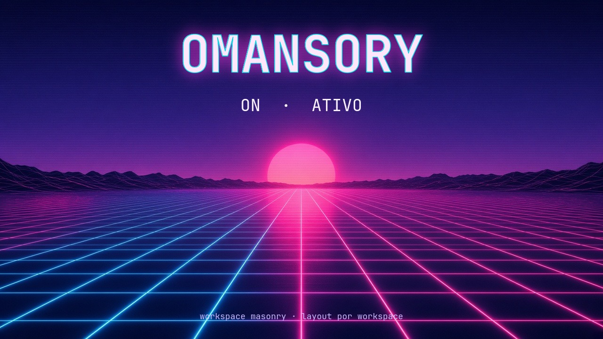

<p align="center">
  
</p>

<p align="center">
  <a href="README.md">English</a>
  ·
  <a href="LICENSE"></a>
  
  
</p>

# Omansory

**Masonry por workspace** para [Omarchy](https://omarchy.org/) / Hyprland. Um atalho empilha as janelas tiled em colunas (a mais baixa primeiro) **só no workspace ativo**. Os outros continuam em dwindle, scrolling ou o que já estiverem usando.

É um layout Lua do Hyprland (`lua:omansory`), não um widget da barra. Ele **não** se encaixa em cima do scrolling: enquanto está ligado, aquele workspace *é* Omansory.

## Instalar

```sh
git clone https://github.com/alcure/omansory.git
cd omansory
chmod +x install.sh bin/omansory
./install.sh
```

O instalador:

1. Cria o symlink do layout em `~/.config/hypr/omansory.lua` e do CLI em `~/.local/bin/omansory`.
2. Insere blocos marcados em `hyprland.lua` e `bindings.lua` (com backup datado).
3. **Substitui Super+Shift+O** (Obsidian padrão) pelo toggle do Omansory.
4. Remapeia o Obsidian para **Super+Shift+Alt+O**.
5. Copia os stills retrowave de ligar/desligar usados nas notificações.

## Uso

| Tecla | Ação |
| --- | --- |
| `Super+Shift+O` | Liga/desliga masonry no workspace **ativo** |
| `Super+Shift+Alt+O` | Obsidian (depois da instalação) |
| `Super+L` | Continua o toggle dwindle ↔ scrolling do Omarchy (se usar, sobrescreve este workspace) |

```sh
omansory toggle
omansory on
omansory off
omansory status
omansory cols 3    # 1–6, ou + / -
```

Ao **ligar**, aparece o cartão da grade magenta (ON · ATIVO). Ao **desligar**, o cartão noturno (OFF · INATIVO). O texto segue `$LANG`. A wordmark usa **JetBrainsMono Nerd Font**, a fonte atual da interface do Omarchy.

## O que o layout faz

Empacota na coluna mais baixa: a janela tenta manter a altura que já tinha; se a coluna estourar a tela, escala para caber; o espaço que sobrar vira furo (wallpaper). Uma janela só ainda ocupa o workspace inteiro. `layoutmsg cols` muda o número de colunas daquele workspace.

Janelas flutuantes / pinadas (incluindo o pop-out `Super+O` do Omarchy) ficam de fora.

## Desinstalar

```sh
omansory uninstall
```

Remove os blocos de config e os symlinks. O clone git permanece.

## Requisitos

Omarchy 4, Hyprland ≥ 0.55 (config Lua), `hyprctl`, `jq`, `python3`, `omarchy-notification-send`.

## Licença

MIT. Ver [CHANGELOG](CHANGELOG.md).
